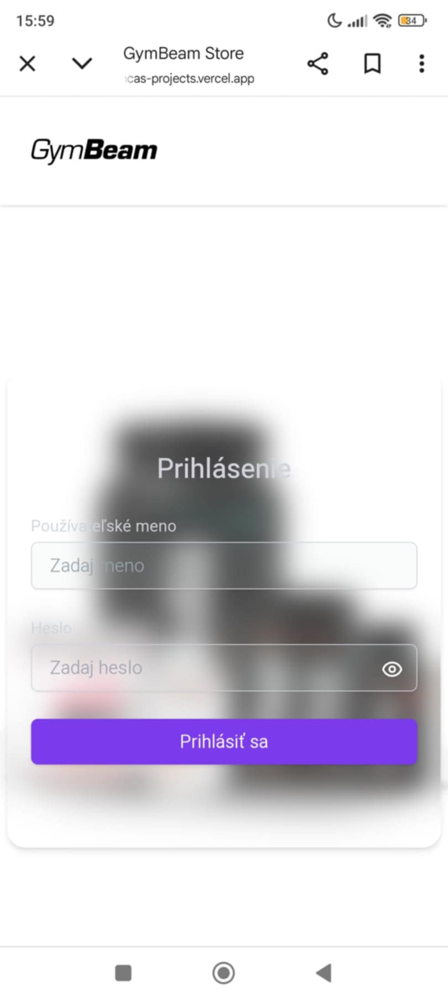
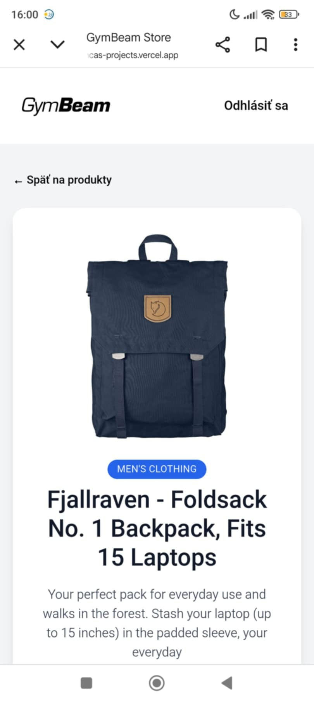
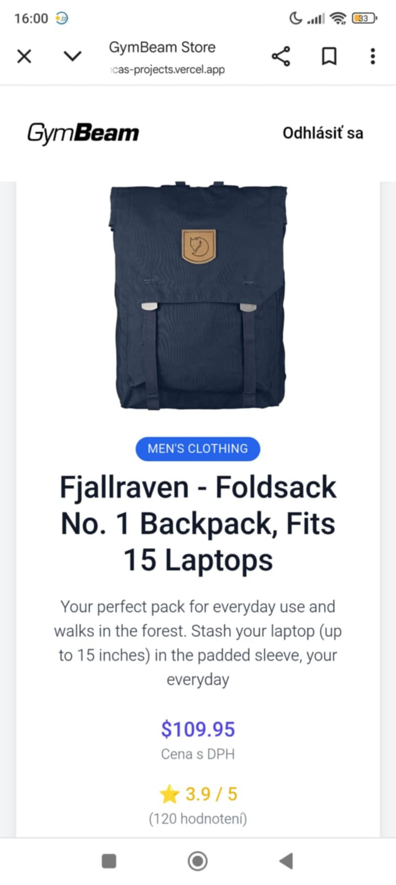
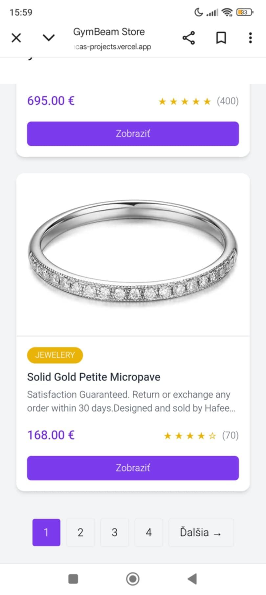
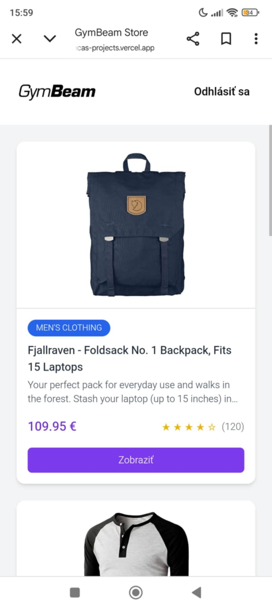

## Getting Started

-Project link:

(https://gymbeam-case-study-git-main-romancas-projects.vercel.app)

1. Clone the repository:

   #### Repository link

   (https://github.com/OEMromanca/gymbeam-case-study)

2. Open the repository:

   #### cd...

3. Install the dependencies:

   #### npm i

   or

   #### yarn

4. Install the dependencies:

   #### npm run dev

   or

   #### yarn dev

   or

   #### pnpm dev

   or

   #### bun dev

Open [http://localhost:3000](http://localhost:3000) with your browser to see the result.

Desktop:

Mobile:

